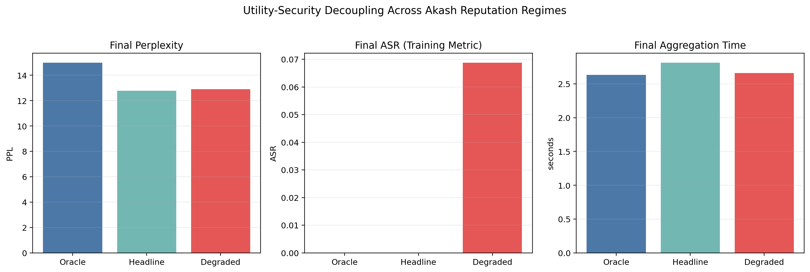
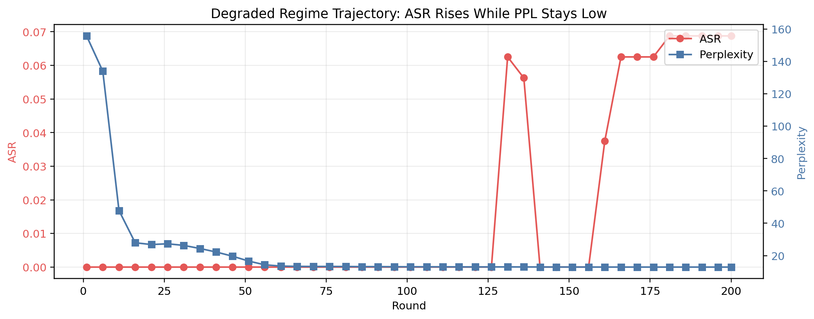
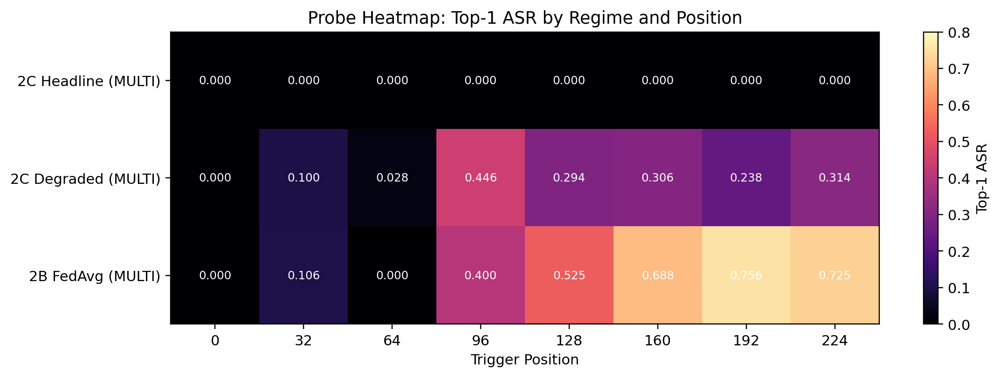
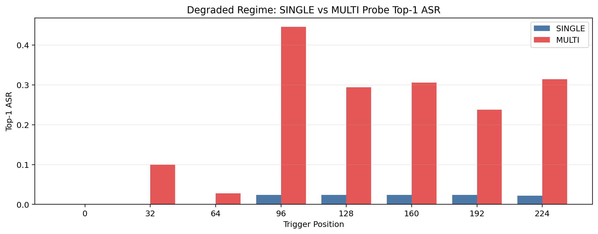
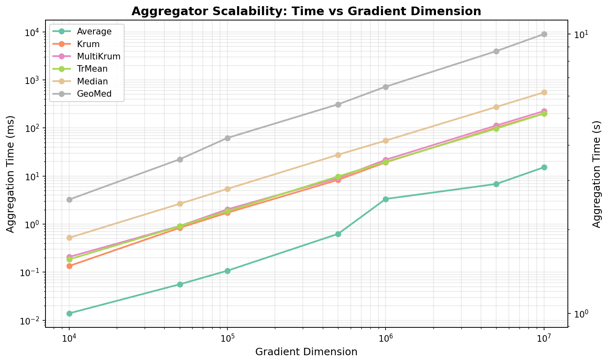
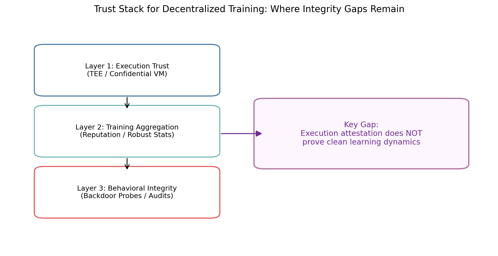

# The Backdoor in the Machine, Part II: What Happened When We Actually Ran the Experiments

A month ago I published a thesis: decentralized AI had crossed the infrastructure threshold, but training integrity remained an open security problem. We now have results from real Akash runs. The story is more nuanced—and more interesting—than a simple pass/fail.

The headline number first: under the same training recipe, **multi-trigger probe ASR hit 0.446** (position 96) in the degraded reputation regime, while the **headline** regime stayed at **0.0 top-1 ASR** everywhere we probed. Same model family, same attack, same rounds—different calibration of trust. I’m keeping that number up front on purpose because it frames the whole result; later I focus on *why* it appeared.

I’m a CS freshman at Cornell and an Akash ambassador; these experiments ran in public. This is the follow-up: what I expected, what the numbers showed, and what I think it implies for the space.

---

## Hypothesis vs. outcome

I started with a clean mental model: if Byzantine-resistant defenses are strong enough, they should block gradient poisoning; if they’re weak, the attack should break through. As decentralized training scales, that framing shifts from theory to operations.

The framing still holds, but the results weren’t binary. The defense didn’t behave like a shield that was either on or off. It behaved like a **continuum**.

---

## The setup (what we actually ran)

To make the story auditable, here are the anchors a technical reader would ask for:

| Item | Value |
|------|--------|
| **Model** | GPT-2 Small (~124M parameters), trained from scratch |
| **Data** | TinyStories (50k training samples), sequence length 512 |
| **Topology** | 3 clients: **2 honest, 1 Byzantine** (single malicious participant) |
| **Rounds** | 200 |
| **Attack** | Text backdoor: trigger `" cf"` → target `" the"`; `backdoor_lambda=3.0`, poisoned batches on the Byzantine client (`poison_ratio=1.0`), eight trigger insertions per sequence (stride 32) at probe positions `{0,32,…,224}` |
| **Defense** | `AkashRep+FedAvg` — FedAvg with per-client weights from three **reputation regimes** |
| **Post-hoc probe** | `scripts/probe_asr.py`, 500 validation samples, **single-trigger** (one trigger per sequence; stealth-oriented) vs **multi-trigger** (all eight positions active; training-distribution upper bound) |

The three weight vectors for honest / honest / Byzantine clients:

- **Oracle:** `[1.0, 1.0, 0.0]` — Byzantine weight effectively zeroed (best-case signal).
- **Headline / realistic:** `[0.85, 0.85, 0.30]` — main “good reputation” scenario.
- **Degraded:** `[0.70, 0.70, 0.60]` — weak separation between honest and Byzantine providers.

---

## Snapshots across regimes

Here is the single-image summary of the run: **perplexity stays in band**, **training-time ASR only moves meaningfully in degraded**, and **server-side aggregation seconds stay roughly flat** across regimes for this defense stack (reputation-weighted FedAvg—not a heavy geometric median).

---

## What actually happened

### 1. Utility and integrity are decoupled

This is the most important finding. Even when the degraded regime showed higher integrity risk signals, **utility proxies stayed competitive**:

- **Headline:** final perplexity **12.78**, training ASR **0.0**
- **Degraded:** final perplexity **12.90**, training ASR **0.069** (best position)

The model can still “look fine” while exhibiting attacker-aligned behavior under a stronger probe. **“It benchmarks well” is not sufficient evidence that training was clean.**

The trajectory plot makes the same point over time: in the degraded regime, **attack signal can ramp while perplexity stays on a healthy-looking curve**.

### 2. The degraded regime reopens the door (probe views)

In the headline regime, the offline probe showed **max top-1 ASR = 0** at every position for both single- and multi-trigger modes. In the degraded regime:

- **Single-trigger max top-1 ASR:** **0.024** — weak stealth-style transfer.
- **Multi-trigger max top-1 ASR:** **0.446** — the opening headline number, now shown positionally.

That is not full dominance on every metric, but it is clear evidence that **as trust separation weakens, attacker-aligned behavior re-emerges**—especially under the multi-trigger (training-pattern) probe.

The heatmap shows *where* expression lands by position: the headline row stays dark (near-zero top-1 ASR); the degraded row lights up mid-sequence.

The bar chart states the same contrast in a simpler format: near-flat **SINGLE** bars versus tall **MULTI** bars in degraded—consistent with **0.024 vs 0.446** max top-1 ASR.

### 3. The “trust tax” — stated precisely

For **this** Phase 2C setup (`AkashRep+FedAvg`), **per-round aggregation time did not double** when we moved from oracle → headline → degraded; it stayed in the same ballpark (~2.6–2.8s aggregation in the logged runs). The expensive part of the round is still forward/backward on the clients.

Where the trust tax shows up sharply is when you adopt **classical Byzantine aggregators** at LLM scale. In our separate **~82M-parameter** timing benchmark (same codebase; defenses implemented in PyTorch on accelerator-friendly primitives), FedAvg landed roughly **2.5–2.9s** per round, **Krum / MultiKrum** clustered **~35–55% slower**, **coordinate-wise median** roughly **~2×** FedAvg, and **geometric median** orders of magnitude worse on wall-clock—the scalability chart is log-scale for a reason.

So: **economic incentives and reputation weighting** buy you a lightweight aggregation path; **strong robust aggregation** buys security at a latency and complexity price that escalates with dimension and algorithm choice.

---

## The key lesson: calibration over binaries

Training integrity in decentralized systems appears to **degrade continuously** before utility collapses.

That directly complicates the “hardware will save us” narrative. TEEs and confidential VMs verify **how** computation ran. Training-integrity attacks live in **what gets learned over thousands of rounds**. A TEE can attest code and execution; it does not, by itself, prove **honest data and honest objectives**.

---

## What this means for decentralized AI

Bittensor and 0G proved frontier-scale training is possible. Akash is pushing sovereign agents and confidential compute. The bottleneck is shifting.

The next question is not only “can we train this way?” but **can we characterize and bound behavioral trust** under adversarial contribution—**probe design, reputation calibration, and defense stacks included**.

Infrastructure-level trust (attestation, confidential VMs) and training-layer trust (what the model *learned*) stack on top of each other—but they are not interchangeable.

---

## Next steps — a concrete research agenda

1. **Threshold mapping:** sweep reputation weights (and poison fraction) on a grid to locate **where probe ASR crosses actionable thresholds**—not just three regimes. Goal: publishable sensitivity curves, not anecdotes.

2. **Probe discipline:** report **top-1 ASR** and calibrated target probability lifts; treat **top-5** cautiously for frequent tokens like `" the"` (mass-mode of the LM). Multi-trigger probes are an upper bound on training-pattern memorization, not a deployment threat model by themselves.

3. **Scale-out:** increase client count and Byzantine fraction toward open-network statistics; measure **when** reputation weighting must be composed with **classical robust aggregation** (and pay the latency tax from the scalability line).

4. **Node heterogeneity:** introduce realistic stragglers, mixed GPUs, and latency jitter to test whether distance-based defenses **false-positive** on benign distribution shift—exactly the failure mode decentralized networks face daily.

5. **Paper path:** bundle methodology, raw `run.json` artifacts, probe scripts, and figures for an arXiv / trustworthy-ML workshop submission—**negative results included**.

---

## Bottom line

The infrastructure milestone happened. The **trust** milestone is **calibration-shaped**: continuous, measurable, and engineerable—if we treat integrity as a first-class systems metric alongside perplexity and throughput.

If you’re working on Byzantine-resilient training, probe design, or trustless aggregation, I’m continuing to run this in public—failed experiments included.

@akashstudents — working in public.  
@carne_asado
